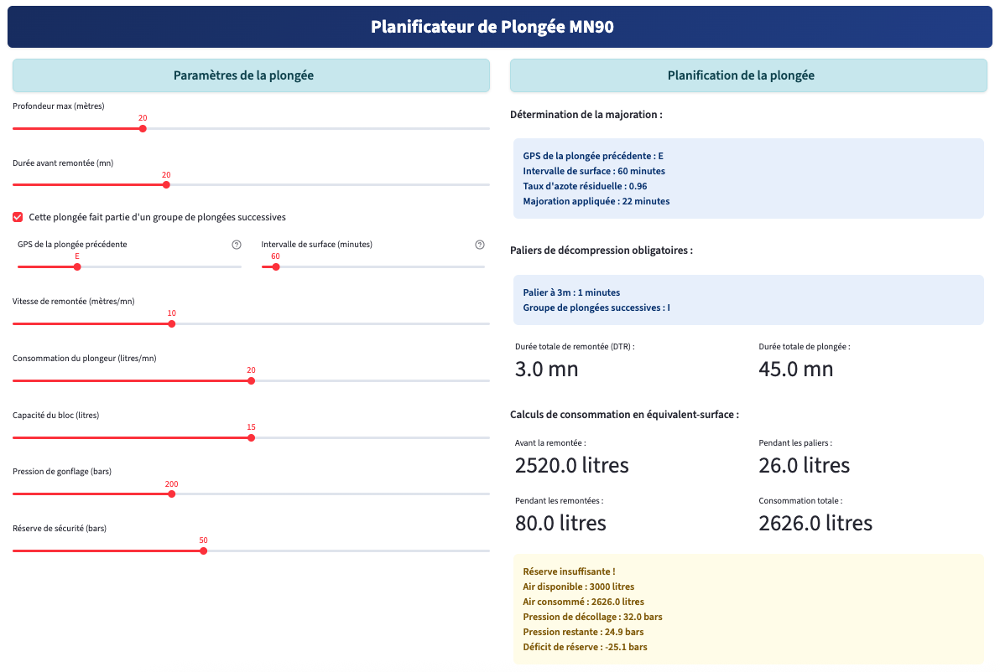

# Diveplanner

Diveplanner est un planificateur de plongées en ligne à vocation pédagogique. Les explications sont dans la section « Détails des calculs » qu’il faut ouvrir pour visualisder les formules utilisée.

Après avoir entré les paramètres envisagés d'une future plongée, trois résultats sont possibles :

- **Plongée réalisable** (dans un cadre vert)
- **Réserve insuffisante** (dans un cadre jaune) 
- **Plongée impossible** (dans un cadre rouge)

Il suffit ensuite d'adapter les paramètres pour rendre la plongée réalisable.

Exemple de plongée possible mais avec réserve insuffisante :

